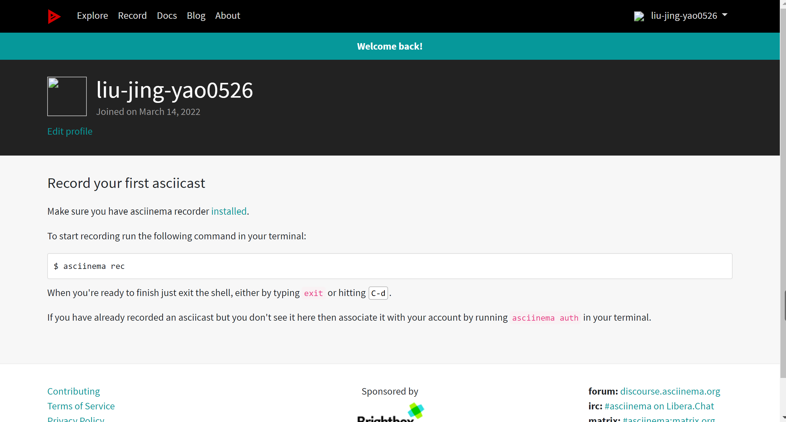
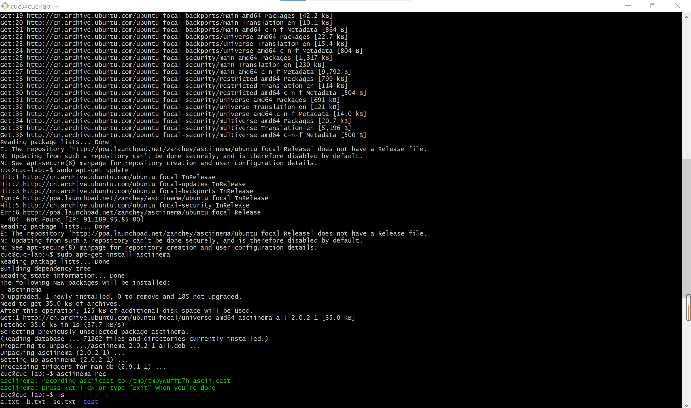
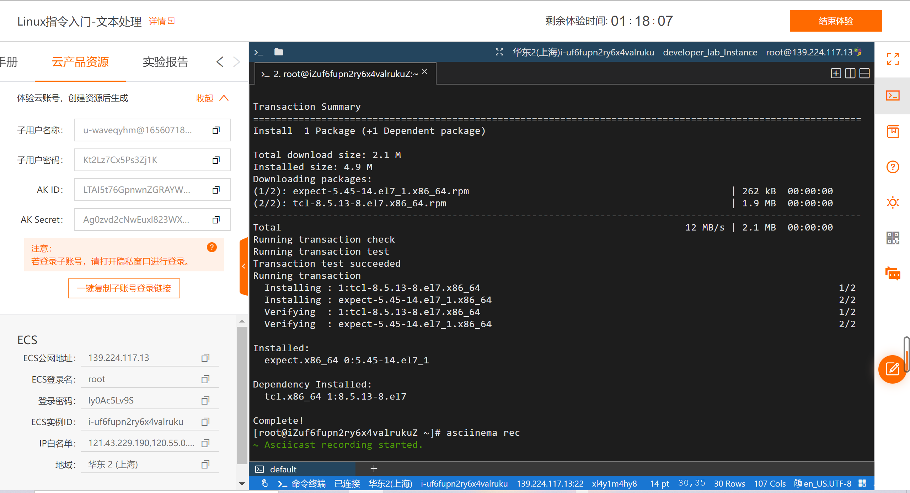
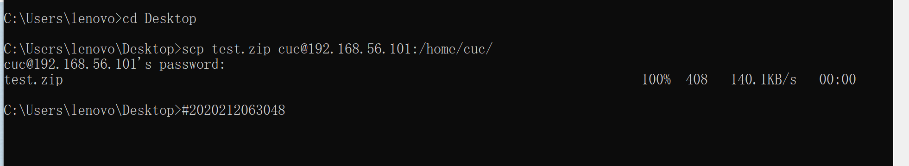
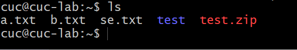
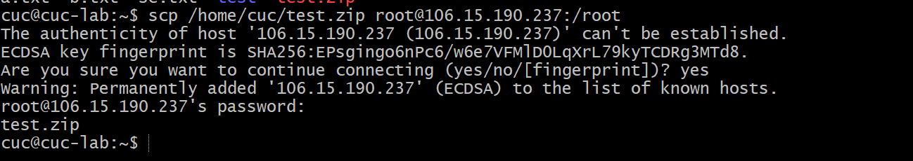
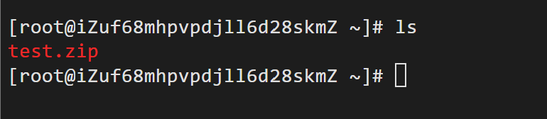
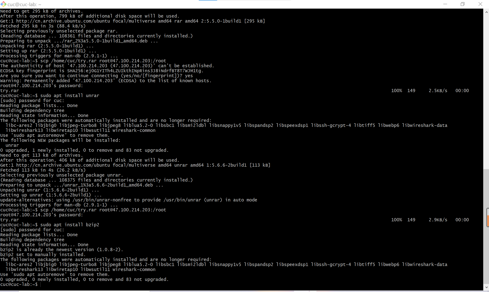
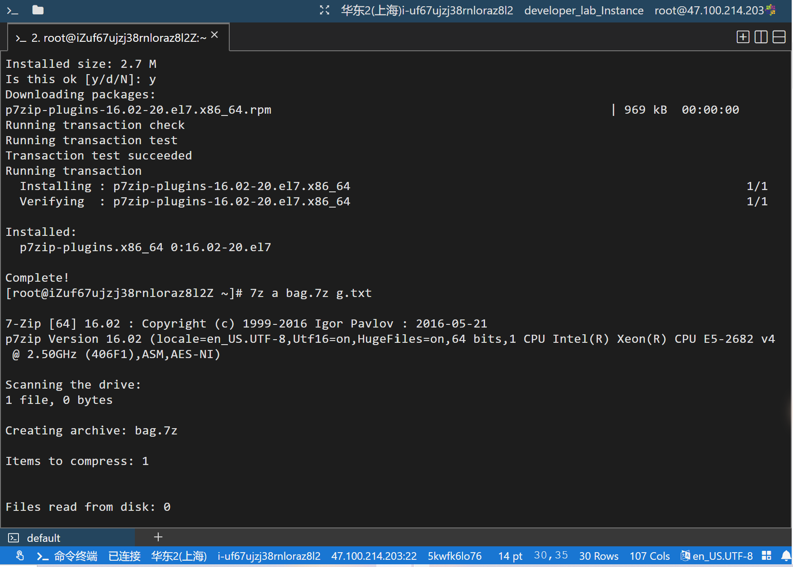
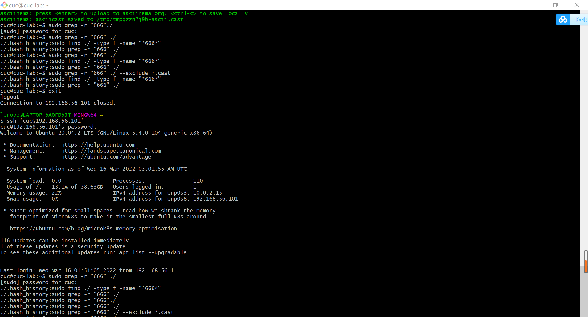

# Linux系统与网络管理（二）

### 配置asciinema

在官网注册账号



**Ubuntu 20.04:**

```
sudo apt-add-repository ppa:zanchey/asciinema
sudo apt-get update
sudo apt-get install asciinema
```



**CentOS 7.7:**

```
yum -y install epel-release   #安装epel发行包`
yum -y install asciinema   #用命令测试版本`
asciinema --version   #用命令测试版本`
yum -y install expect   #安装expect命令 用于交互`
```




### 一、软件包管理

#### **tmux的安装及查看安装路径**

#### tshark的安装、卸载及查看安装路径

**Ubuntu 20.04:**

tmux

```
sudo apt install tmux   #安装tmux
sudo apt-cache show tmux   #查看当前安装路径
```

[](https://asciinema.org/a/476920)

url:https://asciinema.org/a/476920

tshark

```
sudo apt-get install tshark   #安装tshark
sudo apt-cache show tshark    #查看当前安装路径
sudo apt-get remove tshark    #卸载tshark软件包
sudo apt-get purge tshark
which tshark
```

[](https://asciinema.org/a/477103)

url:https://asciinema.org/a/477103

**CentOS 7.7:**

tmux

```
yum install tmux   #安装tmux
rpm -qal |grep tmux   #查看当前安装路径
```

[](https://asciinema.org/a/476967)

url:https://asciinema.org/a/476967

tshark

```
#centos中没有tshark这个包，而是将tshark包含在了wireshark这个包里，因此仅需要安装wireshark即可
yum install wireshark   
rpm -qal |grep wireshark   #卸载wireshark
yum -y remove wireshark
which wireshark
```

[](https://asciinema.org/a/477109)

url:https://asciinema.org/a/477109


### 二、文件管理

复制以下 `shell` 代码到终端运行:

```
cd /tmp && for i in $(seq 0 1024);do dir="test-$RANDOM";mkdir "$dir";echo "$RANDOM" > "$dir/$dir-$RANDOM";done
```

**Ubuntu 20.04:**

- 找到 `/tmp` 目录及其所有子目录下，文件名包含 `666` 的所有文件

`sudo find ./ -type f -name "*666*"`

[](https://asciinema.org/a/477114)

url:https://asciinema.org/a/477114

- 找到 `/tmp` 目录及其所有子目录下，文件内容包含 `666` 的所有文件

```
sudo grep -r "666" ./   
#通过exclude排除asciinema录制时在当前目录写入的后缀为“.cast”的文件
sudo grep -r "666" ./ --exclude=*.cast
```

[](https://asciinema.org/a/477118)

url:https://asciinema.org/a/477118

**CentOS 7.7:**

- 找到 `/tmp` 目录及其所有子目录下，文件名包含 `666` 的所有文件

`find / -name '*666*'`

[](https://asciinema.org/a/477124)

url:https://asciinema.org/a/477124

- 找到 `/tmp` 目录及其所有子目录下，文件内容包含 `666` 的所有文件

`grep -r "666"`

[](https://asciinema.org/a/477125)

url:https://asciinema.org/a/477125


### 三、文件压缩与解压缩

首先按照上次作业的方法将主机上的test.zip、try.rar发送至虚拟机以及远程平台上，并进行确认

```
#发送
scp test.zip cuc@192.168.56.101:/home/cuc/
scp /home/cuc/test.zip root@101.133.160.228:/root
ls   #确认
```

Ubuntu 20.04:





CentOS7.7:





**Ubuntu 20.04:**

zip（跟随老师视频操作）:

```
sudo apt install unzip  #安装unzip
unzip -l test.zip
unzip -O cp936 -l test.zip
unzip -O cp936 test.zip  #解压，防止乱码
find / -name a.txt   #进行确认
find / -name b.txt
```

[](https://asciinema.org/a/477149)

url:https://asciinema.org/a/477149

其它压缩与解压缩命令：

准备工作：

```
#安装不同命令需要的包
sudo apt install p7zip-full
sudo apt install rar
sudo apt install unrar
sudo apt install bzip2
```



代码：

```
#gzip
gzip -v c.txt
gzip -d c.txt.gz
#bzip2
bzip2 -zv d.txt
bzip2 -d d.txt.bz2
#tar
tar -cvf pac.tar e.txt f.txt
tar -xvf pac.tar
#7z
7z a bag.7z g.txt
7z x bag.7z
#unrar
unrar e try.rar
```

[](https://asciinema.org/a/477382)

url:https://asciinema.org/a/477382

**CentOS 7.7:**

zip（跟随老师视频操作）:

```
yum install unzip   #安装unzip
unzip -l test.zip
unzip -O cp936 -l test.zip
unzip -O cp936 test.zip   #解压，防止乱码
find / -name a.txt   #进行确认
find / -name b.txt
```

[](https://asciinema.org/a/477147)

url:https://asciinema.org/a/477147

其它压缩与解压缩命令：

准备工作：

```
#安装7zip
yum install p7zip p7zip-plugins
#centos7.7中没有rar和unrar的包，需要从官网上下载压缩包，解压后安装
wget https://www.rarlab.com/rar/rarlinux-x64-5.5.0.tar.gz
tar -zxvf rarlinux-x64-5.5.0.tar.gz
#安装bzip2
yum install bzip2
```



代码：

```
#gzip
gzip -v c.txt
gzip -d c.txt.gz
#bzip2
bzip2 -zv d.txt
bzip2 -d d.txt.bz2
#tar
tar -cvf pac.tar e.txt f.txt
tar -xvf pac.tar
#7z
7z a bag.7z g.txt
7z x bag.7z
#unrar
unrar e try.rar
```

[](https://asciinema.org/a/477376)

url:https://asciinema.org/a/477376


### 四、子进程管理实验

**Ubuntu 20.04:**

[](https://asciinema.org/a/477540)

url:https://asciinema.org/a/477540

**CentOS 7.7:**

[](https://asciinema.org/a/477392)

url:https://asciinema.org/a/477392


### 五、硬件信息获取

**Ubuntu 20.04:**

```
#CPU
grep "model name" /proc/cpuinfo |awk -F ':' '{print $NF}'  #型号
cat /proc/cpuinfo | grep "physical id" | uniq | wc -l  #电脑处理器数量
cat /proc/cpuinfo | grep "cpu cores" | uniq   #电脑处理器核数
#内存
free -m  #内存信息
#硬盘
sudo fdisk -l |grep "Disk /dev/sd"   #硬盘的数量和大小
```

[](https://asciinema.org/a/477544)

url:https://asciinema.org/a/477544

**CentOS 7.7:**

```
#CPU
cat /proc/cpuinfo | grep name | cut -f2 -d: | uniq -c  #查看CPU信息
#内存
free -m   #查看内存信息
#硬盘
df -hl   #查看硬盘剩余空间
df -h    #查看每个根路径的分区大小
```

[](https://asciinema.org/a/477547)

url:https://asciinema.org/a/477547


### 结果总结

| **Linux发行版本**           | **Ubuntu 20.04**                         | **CentOS 7.7**         |
| --------------------------- | ---------------------------------------- | ---------------------- |
| **安装软件包**              | `apt install`                            | `yum install`          |
| **更新软件包**              | `apt upgrade`                            | `yum update`           |
| **卸载软件包**              | `apt remove`                             | `yum remove`           |
| **查看软件包安装路径**      | `apt show`                               | `yum search`           |
| **查找文件名**              | `sudo find ./ -type f -name "*666*"`     | `find / -name '*666*'` |
| **查找文件内容**            | `sudo grep -r "666" ./ --exclude=*.cast` | `grep -r "666"`        |
| **文件压缩与解压缩(zip)**   | `unzip -O`                               | `unzip -O`             |
| **文件压缩与解压缩(gzip)**  | `gzip -v/gzip -d`                        | `gzip -v/gzip -d`      |
| **文件压缩与解压缩(bzip2)** | `bzip2 -zv/bzip2 -d`                     | `bzip2 -zv/bzip2 -d`   |
| **文件压缩与解压缩(tar)**   | `tar -cvf/tar -xvf`                      | `tar -cvf/tar -xvf`    |
| **文件压缩与解压缩(7z)**    | `7z a/7z x`                              | `7z a/7z x`            |
| **文件压缩与解压缩(rar)**   | `unrar e`                                | `unrar e`              |
| **CPU信息获取**             | cat /proc/cpuinfo                        | cat /proc/cpuinfo      |
| **内存信息获取**            | free -m                                  | free -m                |
| **硬盘信息获取**            | sudo fdisk -l                            | df -hl                 |


### 实验中遇到的问题及解决方案

1、在CentOS7.7中，安装包的查询下载和查找文件等方面与Ubuntu 20.04有着很多不同，在语法上有所区别。通过网上查阅相关资料和文档，在实践中解决问题。

2、在CentOS7.7的平台上，发现没有tshark的软件包，查阅了相关资料后明白在CentOS下tshark的安装包是包含在wireshark的安装包中，所以只需要安装wireshark即可。

3、在使用`sudo grep -r "666" ./` 命令时出错，命令行显示的是上一步操作。在gitbash上退出又重新登录后问题得以解决。



4、在CentOS7.7的平台上，安装软件包的操作和在Ubuntu 20.04上有所不同。在安装rar和unrar时 ，不能直接通过`yum install rar`安装。查阅资料后，用`yum install epel-release`命令安装拓展包更新包，再通过yum update更新yum源，结果依然无法安装。最后经过多番查找后了解到了应该先在官网上下载压缩包，解压后再使用的正确的解决方法。

```
## 64 bit linux ##
wget https://www.rarlab.com/rar/rarlinux-x64-5.5.0.tar.gz
tar -zxvf rarlinux-x64-5.5.0.tar.gz
cd rar
sudo cp -v rar unrar /usr/local/bin/
```


### 参考链接

[Linux系统与网络管理 (c4pr1c3.github.io)](https://c4pr1c3.github.io/LinuxSysAdmin/chap0x02.md.html#/title-slide)

[Installation - asciinema](https://asciinema.org/docs/installation)

[CentOS下Tmux安装和使用 - jlins - 博客园 (cnblogs.com)](https://www.cnblogs.com/dyllove98/p/4096019.html)

[Install rar/unrar on CentOS 7 | Bits and Dragons (wordpress.com)](https://bitsanddragons.wordpress.com/2018/01/09/install-rar-unrar-on-centos-7/)

https://mbd.baidu.com/ug_share/mbox/4a81af9963/share?tk=67b832ba50ddcb1185c8d1ee589f4a99&share_url=https%3A%2F%2Fyebd1h.smartapps.cn%2Fpages%2Fblog%2Findex%3FblogId%3D103170541%26_swebfr%3D1%26_swebFromHost%3Dbaiduboxapp

[CentOS使用rpm安装tshark_huapi6的博客-CSDN博客_tshark 安装](https://blog.csdn.net/huapi6/article/details/102679097)

[Centos7常用命令[压缩与解压缩\]-阿里云开发者社区 (aliyun.com)](https://developer.aliyun.com/article/329913)


