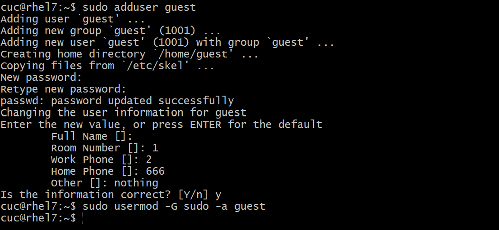
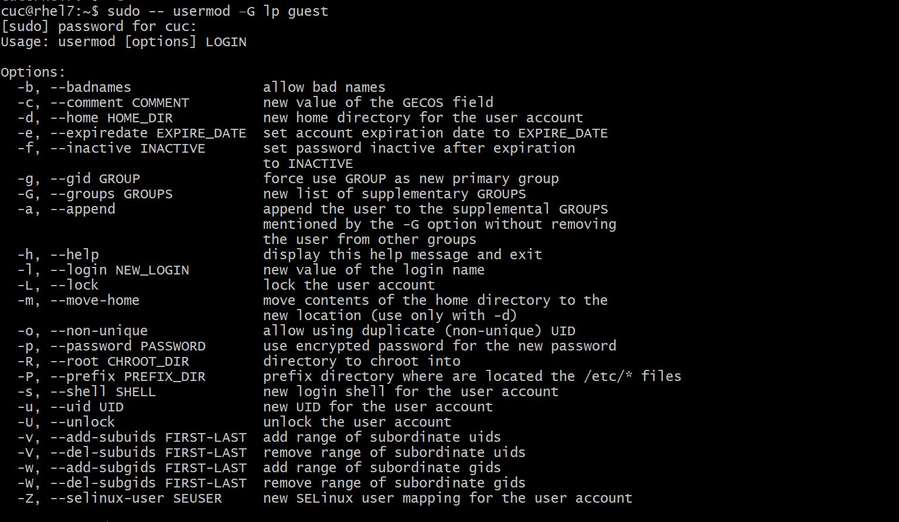
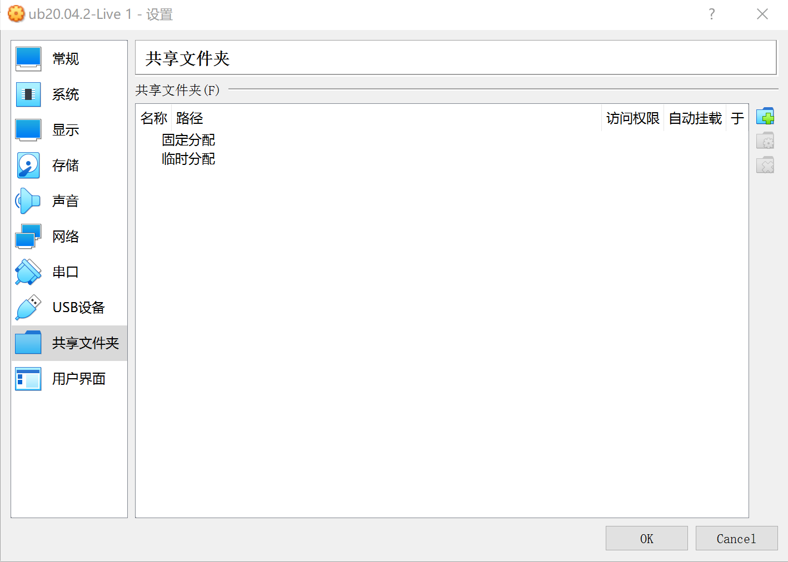
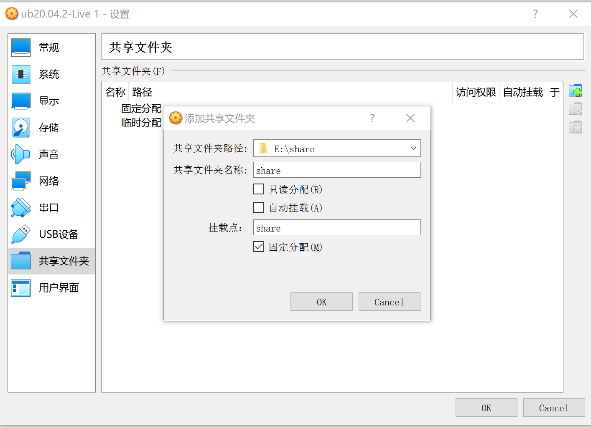
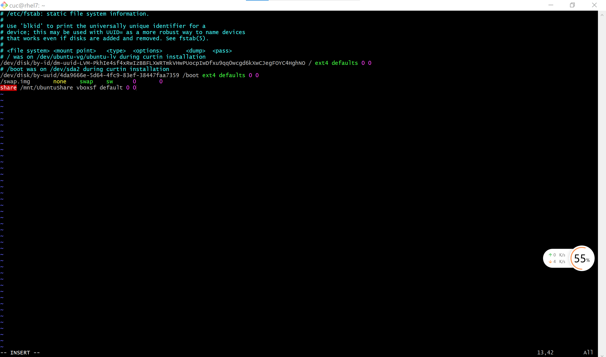

## Linux网络与系统管理实验（三）Systemd入门教程

### 实验环境

VirtualBox 6.1

Ubuntu 20.04.02 Server 64bit

### 实验内容

根据Systemd入门教程：命令篇完成相关操作

根据Systemd入门教程：实战篇完成相关操作

自查清单

### 一、根据Systemd入门教程：命令篇完成相关操作

#### 3.2 systemd-analyze

`systemd-analyze`命令用于查看启动耗时。

```bash
# 查看启动耗时
$ systemd-analyze                                                                         
# 查看每个服务的启动耗时
$ systemd-analyze blame
# 显示瀑布状的启动过程流
$ systemd-analyze critical-chain
# 显示指定服务的启动流
$ systemd-analyze critical-chain atd.service
```

[](https://asciinema.org/a/2JwZTrjgQRv5VrrzLkHJgtAJ1)

url:https://asciinema.org/a/2JwZTrjgQRv5VrrzLkHJgtAJ1

#### 3.3 hostnamectl

`hostnamectl`命令用于查看当前主机的信息。

```bash
# 显示当前主机的信息
$ hostnamectl
# 设置主机名。
$ sudo hostnamectl set-hostname rhel7
```

[](https://asciinema.org/a/QdpGOJICJ7XccqfjATzS3YFTH)

url:https://asciinema.org/a/QdpGOJICJ7XccqfjATzS3YFTH

#### 3.4 localectl

`localectl`命令用于查看本地化设置。

```bash
# 查看本地化设置
$ localectl
# 设置本地化参数。
$ sudo localectl set-locale LANG=en_GB.utf8
$ sudo localectl set-keymap en_GB
```

[](https://asciinema.org/a/I91hnK2h6B9caZpL0apEmusBX)

url:https://asciinema.org/a/I91hnK2h6B9caZpL0apEmusBX

#### 3.5 timedatectl

`timedatectl`命令用于查看当前时区设置。

```bash
# 查看当前时区设置
$ timedatectl
# 显示所有可用的时区
$ timedatectl list-timezones                                                             
# 设置当前时区
$ sudo timedatectl set-timezone America/New_York
$ sudo timedatectl set-time YYYY-MM-DD
$ sudo timedatectl set-time HH:MM:SS
```

[](https://asciinema.org/a/Se1PyHJ6uYgjHhHuvGLGuyvkg)

url:https://asciinema.org/a/Se1PyHJ6uYgjHhHuvGLGuyvkg

#### 3.6 loginctl

`loginctl`命令用于查看当前登录的用户。

```bash
# 列出当前session
$ loginctl list-sessions
# 列出当前登录用户
$ loginctl list-users
# 列出显示指定用户的信息
$ loginctl show-user ruanyf
```

[](https://asciinema.org/a/7t0hHGIRx9ET8EWgd3aoJPr6q)

url:https://asciinema.org/a/7t0hHGIRx9ET8EWgd3aoJPr6q

#### 4.1 Unit含义

Systemd 可以管理所有系统资源。不同的资源统称为 Unit（单位）。

Unit 一共分成12种。

- Service unit：系统服务
- Target unit：多个 Unit 构成的一个组
- Device Unit：硬件设备
- Mount Unit：文件系统的挂载点
- Automount Unit：自动挂载点
- Path Unit：文件或路径
- Scope Unit：不是由 Systemd 启动的外部进程
- Slice Unit：进程组
- Snapshot Unit：Systemd 快照，可以切回某个快照
- Socket Unit：进程间通信的 socket
- Swap Unit：swap 文件
- Timer Unit：定时器

`systemctl list-units`命令可以查看当前系统的所有 Unit 。

```bash
# 列出正在运行的 Unit
$ systemctl list-units
# 列出所有Unit，包括没有找到配置文件的或者启动失败的
$ systemctl list-units --all
# 列出所有没有运行的 Unit
$ systemctl list-units --all --state=inactive
# 列出所有加载失败的 Unit
$ systemctl list-units --failed
# 列出所有正在运行的、类型为 service 的 Unit
$ systemctl list-units --type=service
```

[](https://asciinema.org/a/wfXVUmvOBWad0CjzNjaizLCG7)

url:https://asciinema.org/a/wfXVUmvOBWad0CjzNjaizLCG7

#### 4.2 Unit 的状态

`systemctl status`命令用于查看系统状态和单个 Unit 的状态。

```bash
# 显示系统状态
$ systemctl status
# 显示单个 Unit 的状态
$ sysystemctl status bluetooth.service
# 显示远程主机的某个 Unit 的状态
$ systemctl -H root@rhel7.example.com status httpd.service
```

除了`status`命令，`systemctl`还提供了三个查询状态的简单方法，主要供脚本内部的判断语句使用。

```bash
# 显示某个 Unit 是否正在运行
$ systemctl is-active application.service
# 显示某个 Unit 是否处于启动失败状态
$ systemctl is-failed application.service
# 显示某个 Unit 服务是否建立了启动链接
$ systemctl is-enabled application.service
```

[](https://asciinema.org/a/7QMfKVG363zM2uIe6DID0vQq3)

url:https://asciinema.org/a/7QMfKVG363zM2uIe6DID0vQq3

#### 4.3 Unit 管理

```bash
# 立即启动一个服务
$ sudo systemctl start apache.service
# 立即停止一个服务
$ sudo systemctl stop apache.service
# 重启一个服务
$ sudo systemctl restart apache.service
# 杀死一个服务的所有子进程
$ sudo systemctl kill apache.service
# 重新加载一个服务的配置文件
$ sudo systemctl reload apache.service
# 重载所有修改过的配置文件
$ sudo systemctl daemon-reload
# 显示某个 Unit 的所有底层参数
$ systemctl show httpd.service
# 显示某个 Unit 的指定属性的值
$ systemctl show -p CPUShares httpd.service
# 设置某个 Unit 的指定属性
$ sudo systemctl set-property httpd.service CPUShares=500
```

[](https://asciinema.org/a/2JfuYmNpZ8EWTyL8SA0XLyjVD)

url:https://asciinema.org/a/2JfuYmNpZ8EWTyL8SA0XLyjVD

#### 4.4 依赖关系

Unit 之间存在依赖关系：A 依赖于 B，就意味着 Systemd 在启动 A 的时候，同时会去启动 B。

`systemctl list-dependencies`命令列出一个 Unit 的所有依赖。

```bash
$ systemctl list-dependencies nginx.service
```

上面命令的输出结果之中，有些依赖是 Target 类型（详见下文），默认不会展开显示。如果要展开 Target，就需要使用`--all`参数。

```bash
$ systemctl list-dependencies --all nginx.service
```

[](https://asciinema.org/a/5RD3N4TmlxyX0wf2kUyL7WADd)

url:https://asciinema.org/a/5RD3N4TmlxyX0wf2kUyL7WADd

#### 5.1 概述

每一个 Unit 都有一个配置文件，告诉 Systemd 怎么启动这个 Unit 。

Systemd 默认从目录`/etc/systemd/system/`读取配置文件。但是，里面存放的大部分文件都是符号链接，指向目录`/usr/lib/systemd/system/`，真正的配置文件存放在那个目录。

`systemctl enable`命令用于在上面两个目录之间，建立符号链接关系。

```bash
$ sudo systemctl enable ssh@atd.service
# 等同于
$ sudo ln -s '/usr/lib/systemd/system/clamd@scan.service' '/etc/systemd/system/multi-user.target.wants/ssh@atd.service'
```

如果配置文件里面设置了开机启动，`systemctl enable`命令相当于激活开机启动。

与之对应的，`systemctl disable`命令用于在两个目录之间，撤销符号链接关系，相当于撤销开机启动。

```bash
$ sudo systemctl disable ssh@atd.service
```

配置文件的后缀名，就是该 Unit 的种类，比如`sshd.socket`。如果省略，Systemd 默认后缀名为`.service`，所以`sshd`会被理解成`sshd.service`。

[](https://asciinema.org/a/MOcCZn6Shvjf3Bu7p8HyjAVEF)

url:https://asciinema.org/a/MOcCZn6Shvjf3Bu7p8HyjAVEF

#### 5.2 配置文件的状态

`systemctl list-unit-files`命令用于列出所有配置文件。

```bash
# 列出所有配置文件
$ systemctl list-unit-files
# 列出指定类型的配置文件
$ systemctl list-unit-files --type=service
```

这个命令会输出一个列表。

```bash
$ systemctl list-unit-files

UNIT FILE              STATE
chronyd.service        enabled
clamd@.service         static
clamd@scan.service     disabled
```

这个列表显示每个配置文件的状态，一共有四种。

- enabled：已建立启动链接
- disabled：没建立启动链接
- static：该配置文件没有`[Install]`部分（无法执行），只能作为其他配置文件的依赖
- masked：该配置文件被禁止建立启动链接

注意，从配置文件的状态无法看出，该 Unit 是否正在运行。这必须执行前面提到的`systemctl status`命令。

```bash
$ systemctl status atd.service
```

一旦修改配置文件，就要让 SystemD 重新加载配置文件，然后重新启动，否则修改不会生效。

```bash
$ sudo systemctl daemon-reload
$ sudo systemctl restart httpd.service
```

[](https://asciinema.org/a/TPRFNj9cICA7DN6yxFkgFNMkB)

url:https://asciinema.org/a/TPRFNj9cICA7DN6yxFkgFNMkB

#### 5.3 配置文件的格式

配置文件就是普通的文本文件，可以用文本编辑器打开。

`systemctl cat`命令可以查看配置文件的内容。

```bash
$ systemctl cat atd.service
[Unit]
Description=ATD daemon
[Service]
Type=forking
ExecStart=/usr/bin/atd
[Install]
WantedBy=multi-user.target
```

从上面的输出可以看到，配置文件分成几个区块。每个区块的第一行，是用方括号表示的区别名，比如`[Unit]`。注意，配置文件的区块名和字段名，都是大小写敏感的。

每个区块内部是一些等号连接的键值对。

```bash
[Section]
Directive1=value
Directive2=value

. . .
```

注意，键值对的等号两侧不能有空格。

[](https://asciinema.org/a/NR4M2KNUkZltoBJJZVWXmq4fv)

url:https://asciinema.org/a/NR4M2KNUkZltoBJJZVWXmq4fv

#### 5.4 配置文件的区块

`[Unit]`区块通常是配置文件的第一个区块，用来定义 Unit 的元数据，以及配置与其他 Unit 的关系。它的主要字段如下。

- `Description`：简短描述
- `Documentation`：文档地址
- `Requires`：当前 Unit 依赖的其他 Unit，如果它们没有运行，当前 Unit 会启动失败
- `Wants`：与当前 Unit 配合的其他 Unit，如果它们没有运行，当前 Unit 不会启动失败
- `BindsTo`：与`Requires`类似，它指定的 Unit 如果退出，会导致当前 Unit 停止运行
- `Before`：如果该字段指定的 Unit 也要启动，那么必须在当前 Unit 之后启动
- `After`：如果该字段指定的 Unit 也要启动，那么必须在当前 Unit 之前启动
- `Conflicts`：这里指定的 Unit 不能与当前 Unit 同时运行
- `Condition...`：当前 Unit 运行必须满足的条件，否则不会运行
- `Assert...`：当前 Unit 运行必须满足的条件，否则会报启动失败

`[Install]`通常是配置文件的最后一个区块，用来定义如何启动，以及是否开机启动。它的主要字段如下。

- `WantedBy`：它的值是一个或多个 Target，当前 Unit 激活时（enable）符号链接会放入`/etc/systemd/system`目录下面以 Target 名 + `.wants`后缀构成的子目录中
- `RequiredBy`：它的值是一个或多个 Target，当前 Unit 激活时，符号链接会放入`/etc/systemd/system`目录下面以 Target 名 + `.required`后缀构成的子目录中
- `Alias`：当前 Unit 可用于启动的别名
- `Also`：当前 Unit 激活（enable）时，会被同时激活的其他 Unit

`[Service]`区块用来 Service 的配置，只有 Service 类型的 Unit 才有这个区块。它的主要字段如下。

- `Type`：定义启动时的进程行为。它有以下几种值。
- `Type=simple`：默认值，执行`ExecStart`指定的命令，启动主进程
- `Type=forking`：以 fork 方式从父进程创建子进程，创建后父进程会立即退出
- `Type=oneshot`：一次性进程，Systemd 会等当前服务退出，再继续往下执行
- `Type=dbus`：当前服务通过D-Bus启动
- `Type=notify`：当前服务启动完毕，会通知`Systemd`，再继续往下执行
- `Type=idle`：若有其他任务执行完毕，当前服务才会运行
- `ExecStart`：启动当前服务的命令
- `ExecStartPre`：启动当前服务之前执行的命令
- `ExecStartPost`：启动当前服务之后执行的命令
- `ExecReload`：重启当前服务时执行的命令
- `ExecStop`：停止当前服务时执行的命令
- `ExecStopPost`：停止当其服务之后执行的命令
- `RestartSec`：自动重启当前服务间隔的秒数
- `Restart`：定义何种情况 Systemd 会自动重启当前服务，可能的值包括`always`（总是重启）、`on-success`、`on-failure`、`on-abnormal`、`on-abort`、`on-watchdog`
- `TimeoutSec`：定义 Systemd 停止当前服务之前等待的秒数
- `Environment`：指定环境变量

Unit 配置文件的完整字段清单，请参考[官方文档](https://www.freedesktop.org/software/systemd/man/systemd.unit.html)。

#### 6 Target

启动计算机的时候，需要启动大量的 Unit。如果每一次启动，都要一一写明本次启动需要哪些 Unit，显然非常不方便。Systemd 的解决方案就是 Target。

简单说，Target 就是一个 Unit 组，包含许多相关的 Unit 。启动某个 Target 的时候，Systemd 就会启动里面所有的 Unit。从这个意义上说，Target 这个概念类似于"状态点"，启动某个 Target 就好比启动到某种状态。

传统的`init`启动模式里面，有 RunLevel 的概念，跟 Target 的作用很类似。不同的是，RunLevel 是互斥的，不可能多个 RunLevel 同时启动，但是多个 Target 可以同时启动。

```bash
# 查看当前系统的所有 Target
$ systemctl list-unit-files --type=target
# 查看一个 Target 包含的所有 Unit
$ systemctl list-dependencies multi-user.target
# 查看启动时的默认 Target
$ systemctl get-default
# 设置启动时的默认 Target
$ sudo systemctl set-default multi-user.target
# 切换 Target 时，默认不关闭前一个 Target 启动的进程，
# systemctl isolate 命令改变这种行为，
# 关闭前一个 Target 里面所有不属于后一个 Target 的进程
$ sudo systemctl isolate multi-user.target
```

Target 与 传统 RunLevel 的对应关系如下。

```bash
Traditional runlevel      New target name     Symbolically linked to...

Runlevel 0           |    runlevel0.target -> poweroff.target
Runlevel 1           |    runlevel1.target -> rescue.target
Runlevel 2           |    runlevel2.target -> multi-user.target
Runlevel 3           |    runlevel3.target -> multi-user.target
Runlevel 4           |    runlevel4.target -> multi-user.target
Runlevel 5           |    runlevel5.target -> graphical.target
Runlevel 6           |    runlevel6.target -> reboot.target
```

它与`init`进程的主要差别如下。

**（1）默认的 RunLevel**（在`/etc/inittab`文件设置）现在被默认的 Target 取代，位置是`/etc/systemd/system/default.target`，通常符号链接到`graphical.target`（图形界面）或者`multi-user.target`（多用户命令行）。

**（2）启动脚本的位置**，以前是`/etc/init.d`目录，符号链接到不同的 RunLevel 目录 （比如`/etc/rc3.d`、`/etc/rc5.d`等），现在则存放在`/lib/systemd/system`和`/etc/systemd/system`目录。

**（3）配置文件的位置**，以前`init`进程的配置文件是`/etc/inittab`，各种服务的配置文件存放在`/etc/sysconfig`目录。现在的配置文件主要存放在`/lib/systemd`目录，在`/etc/systemd`目录里面的修改可以覆盖原始设置。

[](https://asciinema.org/a/C4SzfAngUjn1mMF5VF6sGeWDV)

url:https://asciinema.org/a/C4SzfAngUjn1mMF5VF6sGeWDV

#### 7 日志管理

Systemd 统一管理所有 Unit 的启动日志。带来的好处就是，可以只用`journalctl`一个命令，查看所有日志（内核日志和应用日志）。日志的配置文件是`/etc/systemd/journald.conf`。

`journalctl`功能强大，用法非常多。

```bash
# 查看所有日志（默认情况下 ，只保存本次启动的日志）
$ sudo journalctl
# 查看内核日志（不显示应用日志）
$ sudo journalctl -k
# 查看系统本次启动的日志
$ sudo journalctl -b
$ sudo journalctl -b -0
# 查看上一次启动的日志（需更改设置）
$ sudo journalctl -b -1
# 查看指定时间的日志
$ sudo journalctl --since="2012-10-30 18:17:16"
$ sudo journalctl --since "20 min ago"
$ sudo journalctl --since yesterday
$ sudo journalctl --since "2015-01-10" --until "2015-01-11 03:00"
$ sudo journalctl --since 09:00 --until "1 hour ago"
# 显示尾部的最新10行日志
$ sudo journalctl -n
# 显示尾部指定行数的日志
$ sudo journalctl -n 20
# 实时滚动显示最新日志
$ sudo journalctl -f
# 查看指定服务的日志
$ sudo journalctl /usr/lib/systemd/systemd
# 查看指定进程的日志
$ sudo journalctl _PID=1
# 查看某个路径的脚本的日志
$ sudo journalctl /usr/bin/bash
# 查看指定用户的日志
$ sudo journalctl _UID=33 --since today
# 查看某个 Unit 的日志
$ sudo journalctl -u nginx.service
$ sudo journalctl -u nginx.service --since today
# 实时滚动显示某个 Unit 的最新日志
$ sudo journalctl -u nginx.service -f
# 合并显示多个 Unit 的日志
$ journalctl -u nginx.service -u php-fpm.service --since today
# 查看指定优先级（及其以上级别）的日志，共有8级
# 0: emerg
# 1: alert
# 2: crit
# 3: err
# 4: warning
# 5: notice
# 6: info
# 7: debug
$ sudo journalctl -p err -b
# 日志默认分页输出，--no-pager 改为正常的标准输出
$ sudo journalctl --no-pager
# 以 JSON 格式（单行）输出
$ sudo journalctl -b -u nginx.service -o json
# 以 JSON 格式（多行）输出，可读性更好
$ sudo journalctl -b -u nginx.serviceqq
 -o json-pretty
# 显示日志占据的硬盘空间
$ sudo journalctl --disk-usage
# 指定日志文件占据的最大空间
$ sudo journalctl --vacuum-size=1G
# 指定日志文件保存多久
$ sudo journalctl --vacuum-time=1years
```

[](https://asciinema.org/a/LeOHbR0xw3zd7D3MsKccpJxha)

url：https://asciinema.org/a/LeOHbR0xw3zd7D3MsKccpJxha

### 二、根据Systemd入门教程：实战篇完成相关操作

[](https://asciinema.org/a/wHiTw3OXVGVPSTetNbOTrCJOt)

url:https://asciinema.org/a/wHiTw3OXVGVPSTetNbOTrCJOt

### 三、自查清单

- #### 如何添加一个用户并使其具备sudo执行程序的权限？

``` bash
sudo adduser guest 
sudo usermod -G sudo -a guest
```



- #### 如何将一个用户添加到一个用户组？

```bash
sudo -- usermod –G lp guest
```



- #### 如何查看当前系统的分区表和文件系统详细信息？

```bash
#查看分区表
sudo fdisk -l 
#显示目前磁盘空间和使用情况   
df -h  
```

[](https://asciinema.org/a/rwpNSikcxHBZJxJ7FRdO6MezW)

url:https://asciinema.org/a/rwpNSikcxHBZJxJ7FRdO6MezW

- #### 如何实现开机自动挂载Virtualbox的共享目录分区？

先在宿主机创建一个共享文件夹，命名为“share”，并在VirtualBox完成设置

点击设备 -> 共享文件夹 -> 共享文件夹...



按照以下图片设置信息



在虚拟机的`/mnt`目录下新建一个共享文件的挂载目录，外部的驱动器根目录就直接挂载到这个目录下，将其命名为“UbuntuShare”

```bash
cd /mnt/ #进入当前文件夹
sudo mkdir UbuntuShare#创建共享文件夹
```

执行挂载命令

`sudo mount -t vboxsf share /mnt/UbuntuShare`


修改 /etc/fstab 文件 在文末添加`share /mnt/UbuntuShare/ vboxsf defaults 0 0`即可完成开机自动挂载




- #### 基于LVM（逻辑分卷管理）的分区如何实现动态扩容和缩减容量？

```bash
fdisk XXX #把分区XXX剩余空间创建分区并改为LVM格式
lvextend -L +<容量> <目录>    #扩容
lvreduce -L -<容量> <目录>    #减容
```

- #### 如何通过systemd设置实现在网络连通时运行一个指定脚本，在网络断开时运行另一个脚本？

  [](https://asciinema.org/a/Fj2pm6MPFqCtyDR0iwYRfu4ax)

  url:https://asciinema.org/a/Fj2pm6MPFqCtyDR0iwYRfu4ax

- #### 如何通过systemd设置实现一个脚本在任何情况下被杀死之后会立即重新启动？实现杀不死？

- 修改配置文件[service]区块，将**restart**设置为**always**

- ```bash
  [Service]
  Restart = always
  ```

- 然后重新加载配置文件`sudo systemctl daemon-reload`

- 重新启动服务`sudo systemctl restart ××××`

### 实验中遇到的问题及解决方法

1、在完成命令篇4.2部分时，is-enabled命令运行失败。查阅了相关资料后，先执行`systemctl list-units`命令，列出正在运行的 Unit，发现atd.service正在运行，于是将该题及后续几题中都替换成atd.service，问题得以解决。

2、在自查清单中完成将一个用户添加到一个用户组时，刚开始由于没有输入正确的用户组出现了错误。查阅了相关资料后，执行`cat /etc/passwd`命令，查看用户组，并选择了lp用户组完成本题。之后执行`usermod -a -G lp guest`命令后出现usermod: cannot lock /etc/passwd; try again later报错。在网上查阅了相关资料后，将命令更改为`sudo -- usermod –G groupname username`，这样就解决了将用户加入到用户组时报标题的错，成功加入之后，需要重新接连服务器，该user就拥有了该group的权限，问题得以解决。

3、在自查清单中完成如何通过systemd设置实现开机自动挂载Virtualbox的共享目录分区时，使用mount -t vboxsf share /mnt/UbuntuShare命令，结果出现share is not a valid block device的报错。查询资料的老师的课件后，用`sudo mount -t vboxsf share /mnt/UbuntuShare`命令代替，解决了问题，进入了vim编辑器。之后我发现无法对文件进行修改，仔细观察后发现当前不是INSERT模式，按i键后开启编辑，之后可正常对文件进行更改。

### 参考链接

[Linux系统与网络管理 (c4pr1c3.github.io)](https://c4pr1c3.github.io/LinuxSysAdmin/chap0x03.md.html#/title-slide)

[Systemd 入门教程：命令篇 by 阮一峰的网络日志](http://www.ruanyifeng.com/blog/2016/03/systemd-tutorial-commands.html)

[Systemd 入门教程：实战篇 by 阮一峰的网络日志](http://www.ruanyifeng.com/blog/2016/03/systemd-tutorial-part-two.html)

[解决usermod: cannot lock /etc/passwd; try again later_weixin_33752045的博客-CSDN博客](https://blog.csdn.net/weixin_33752045/article/details/92437536)

[在Virtualbox下为Ubuntu20.04开机自动挂载共享目录的方法_lili_Andy的博客-CSDN博客](https://blog.csdn.net/jiangdan_lili/article/details/110003759)

[systemctl enable的作用_linux中systemctl详细理解及常用命令_weixin_39963341的博客-CSDN博客](https://blog.csdn.net/weixin_39963341/article/details/111107237)

[进入编辑模式、vim命令模式、vim实践 - 吉米乐享驿站 - 博客园 (cnblogs.com)](https://www.cnblogs.com/lms0755/p/8808931.html)

