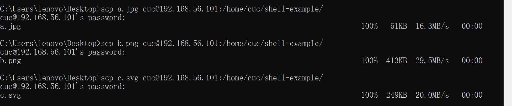
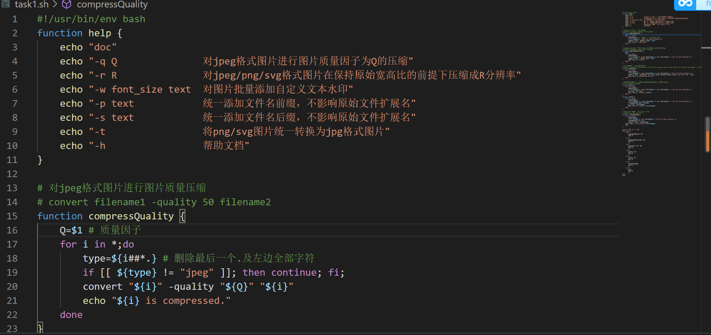
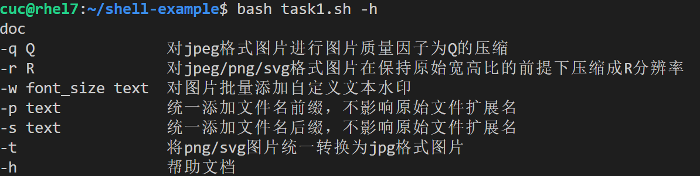
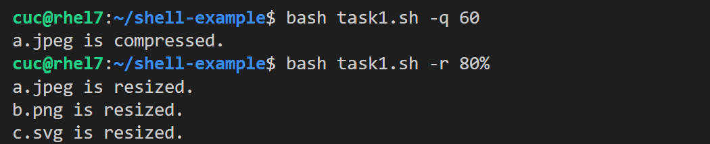
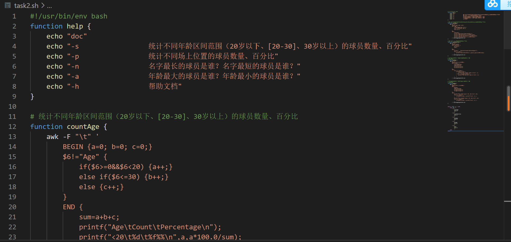
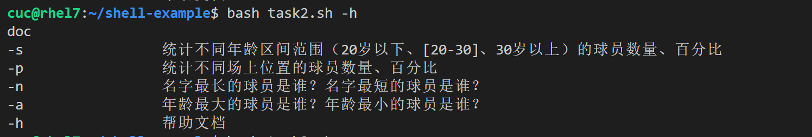
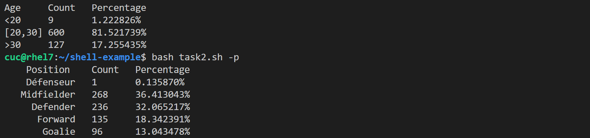
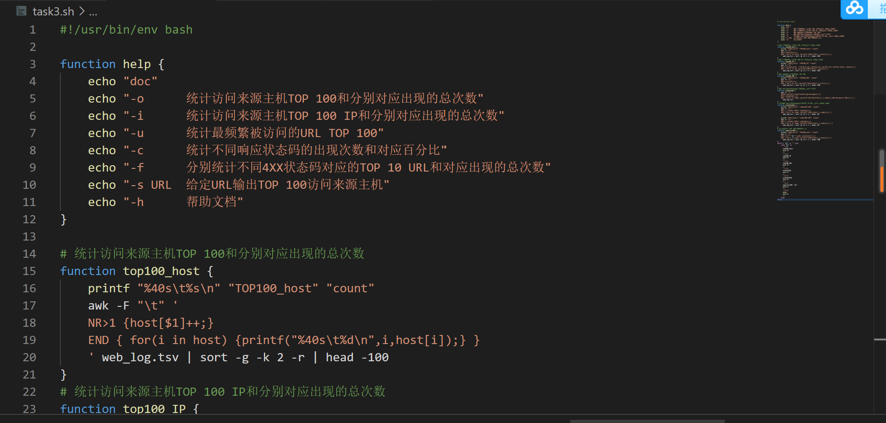
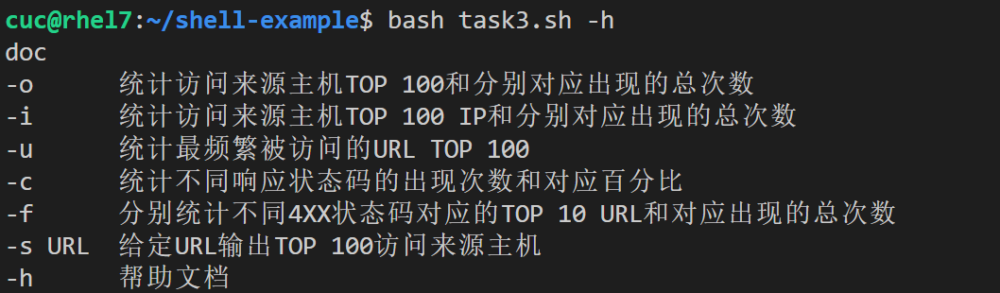
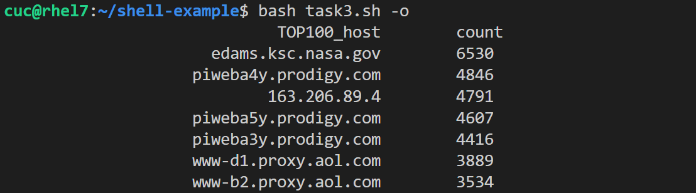

## Linux网络与系统管理实验四

### 实验环境

VirtualBox 6.1

Ubuntu 20.04.02 Server 64bit

Travis CI

VsCode（已安装相应环境依赖）

### 实验内容

### 任务一：用bash编写一个图片批处理脚本，实现以下功能：

- ☑️支持命令行参数方式使用不同功能
- ☑️支持对指定目录下所有支持格式的图片文件进行批处理指定目录进行批处理
- ☑️支持以下常见图片批处理功能的单独使用或组合使用
  - ☑️支持对jpeg格式图片进行图片质量压缩
  - ☑️支持对jpeg/png/svg格式图片在保持原始宽高比的前提下压缩分辨率
  - ☑️支持对图片批量添加自定义文本水印
  - ☑️支持批量重命名（统一添加文件名前缀或后缀，不影响原始文件扩展名）
  - ☑️支持将png/svg图片统一转换为jpg格式

### 任务二：用bash编写一个文本批处理脚本，对以下附件分别进行批量处理完成相应的数据统计任务：

- ☑️统计不同年龄区间范围（20岁以下、[20-30]、30岁以上）的球员数量、百分比
- ☑️统计不同场上位置的球员数量、百分比
- ☑️名字最长的球员是谁？名字最短的球员是谁？
- ☑️年龄最大的球员是谁？年龄最小的球员是谁？

### 任务三：用bash编写一个文本批处理脚本，对以下附件分别进行批量处理完成相应的数据统计任务：

- ☑️统计访问来源主机TOP 100和分别对应出现的总次数
- ☑️统计访问来源主机TOP 100 IP和分别对应出现的总次数
- ☑️统计最频繁被访问的URL TOP 100
- ☑️统计不同响应状态码的出现次数和对应百分比
- ☑️分别统计不同4XX状态码对应的TOP 10 URL和对应出现的总次数
- ☑️给定URL输出TOP 100访问来源主机

#### **实验结果详见**[CUCCS/2022-linux-public-liu-jing-yao0526 - Travis CI (travis-ci.com)](https://app.travis-ci.com/github/CUCCS/2022-linux-public-liu-jing-yao0526)

### 任务一

#### 准备工作：

安装`imagemagick`和`shellcheck`

```bash
sudo apt-get update
sudo apt-get install -y shellcheck
sudo apt-get install imagemagick
```

将主机上的三张图片通过scp的方式传到虚拟机上



#### **操作过程：**

**编写脚本**



**测试结果**





### 任务二

先将需要的文件下载至本地

```bash
wget "https://c4pr1c3.gitee.io/linuxsysadmin/exp/chap0x04/worldcupplayerinfo.tsv"
```

#### **操作过程：**

**编写脚本**



**测试结果**





### 任务三

安装`p7zip-full`

```bash
sudo apt-get install p7zip-full
```

再将所需文件下载至本地并解压

```bash
wget "https://c4pr1c3.gitee.io/linuxsysadmin/exp/chap0x04/worldcupplayerinfo.tsv"
7z x web_log.tsv.7z
```

#### **操作过程：**

**编写脚本**



**测试结果**





### 实验中遇到的问题与解决方案

1、对shell基本语法，包括函数调用等问题很不熟悉，在参考了黄老师的畅课视频、B站视频和往届师姐的代码后能正确编写文件并成功运行。

2、当我进行2014年世界杯运动员的相关姓名统计的时候，发现有一些人名带有特殊符号，于是搜索资料后发现可以通过shell通配符去进行识别。

3、在任务一中，运行`bash task1.sh -w 10 Allie`命令，可以正常添加水印，但在travis运行报错 `convert:unable to read font (null)`，后来查阅相关资料后增加安装 `ghostscript`，这样问题得以解决。

4、（一个或许和本次实验关系不大的问题）在试用Travis时，我先创建了自己的小仓库进行试验，但是发现仓库无论如何都克隆不到本地文件夹，于是我重新配置了公私钥对，但还是不能解决，并有报错：You‘re are using an RSA key with SHA-1, which is no longer allowed。在网上查阅相关资料后发现，2021年11月2日之前使用SHA-1签名生成的[RSA](https://so.csdn.net/so/search?q=RSA&spm=1001.2101.3001.7020)秘钥可以继续使用，之后生成的必须用SHA-2签名。于是我换用了2020年9月配置的私钥进行克隆，问题得以解决。

5、关于Travis。我第一次使用，非常不熟练，在反复阅读畅课讨论区同学们的帖子和观看黄老师的视频后进行操作。**需要特别注意的是，.travis.yml文件应当放在当前分支下的根目录里。**

### 参考链接

[Linux 系统与网络管理(2021)_哔哩哔哩_bilibili](https://www.bilibili.com/video/BV1Hb4y1R7FE?p=67)

[Linux系统与网络管理 (c4pr1c3.github.io)](https://c4pr1c3.github.io/LinuxSysAdmin/chap0x04.md.html#/title-slide)

[CUCCS/linux-2020-LyuLumos: linux-2020-LyuLumos created by GitHub Classroom](https://github.com/CUCCS/linux-2020-LyuLumos)

[ shell多进程处理多图像_Little_sky_jty的博客-CSDN博客](https://blog.csdn.net/weixin_40805392/article/details/104792874)

[Shell 教程 | 菜鸟教程 (runoob.com)](https://www.runoob.com/linux/linux-shell.html)

[ shell学习教程(超详细完整)_路人甲_passerby的博客-CSDN博客_shell教程](https://blog.csdn.net/w918589859/article/details/108752592)

[Travis CI Tutorial - Travis CI (travis-ci.com)](https://docs.travis-ci.com/user/tutorial/?utm_source=help-page&utm_medium=travisweb)

[webstorm无法连接github报You‘re are using an RSA key with SHA-1, which is no longer allowed._熊人出没的博客-CSDN博客](https://blog.csdn.net/xtonychenx/article/details/123739392)

[vscode连接虚拟机 - 程序员大本营 (pianshen.com)](https://www.pianshen.com/article/46881682669/)

[Travis Ci的最接地气的中文使用教程 - 简书 (jianshu.com)](https://www.jianshu.com/p/8308b8f08de9)

