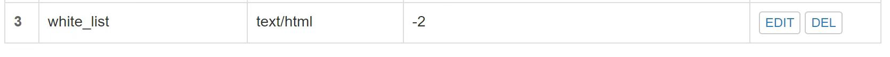
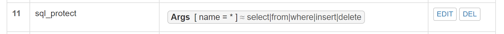
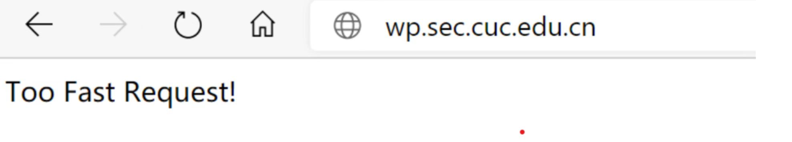
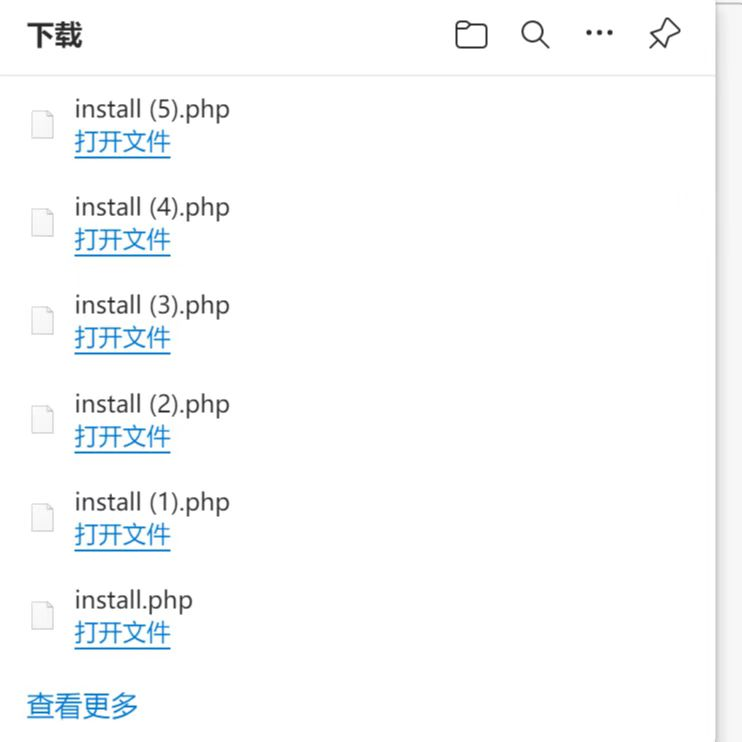
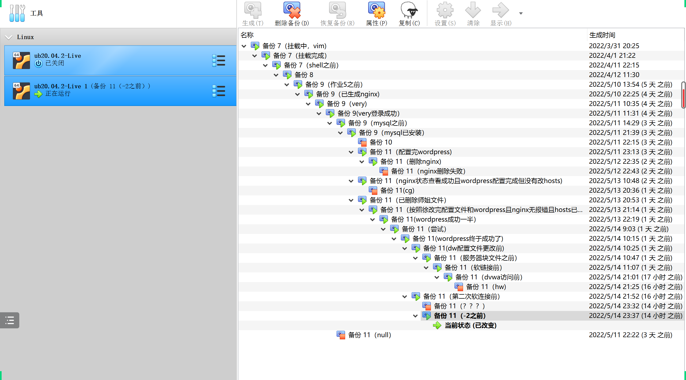

# Linux网络与系统管理实验（五）

## **实验环境**

- Ubuntu 20.04 
- 软件环境
- Nginx
- VeryNginx
- WordCompress 4.7
- DVWA

## **实验内容**

### 1、基本要求

- 在⼀台主机（虚拟机）上同时配置Nginx和VeryNginx

- VeryNginx作为本次实验的Web App的反向代理服务器和WAF

- PHP-FPM进程的反向代理配置在nginx服务器上，VeryNginx服务器不直接配置Web站点服务

- 使用Wordpress搭建的站点对外提供访问的地址为： http://wp.sec.cuc.edu.cn

- 使用Damn Vulnerable Web Application (DVWA)搭建的站点对外提供访问的地址为：

  http://dvwa.sec.cuc.edu.cn

### 2、安全加固要求

- 使⽤IP地址方式均无法访问上述任意站点，并向访客展示⾃定义的友好错误提示信息页面-1

- Damn Vulnerable Web Application (DVWA)只允许白名单上的访客来源IP，其他来源的IP访问均向访客展示

​       自定义的友好错误提示信息页面-2

- 在不升级Wordpress版本的情况下，通过定制VeryNginx的访问控制策略规则，热修复WordPress < 4.7.1 -

  Username Enumeration

- 通过配置VeryNginx的Filter规则实现对Damn Vulnerable Web Application (DVWA)的SQL注⼊实验在低安全

  等级条件下进行防护

### 2、VeryNginx配置要求

- VeryNginx的Web管理页面仅允许⽩名单上的访客来源IP，其他来源的IP访问均向访客展示自定义的友好错误

提示信息页面-3

- 通过定制VeryNginx的访问控制策略规则实现：

​        限制DVWA站点的单IP访问速率为每秒请求数 < 50

​        限制Wordpress站点的单IP访问速率为每秒请求数 < 20

​        超过访问频率限制的请求直接返回⾃定义错误提示信息页面-4

​        禁止curl访问

## 实验过程

### ⼀、环境搭建

### 安装配置VeryNginx

```shell
# 克隆VeryNginx仓库
git clone https://github.com/alexazhou/VeryNginx.git
cd VeryNginx
# python3
sudo python3 install.py install
```

- #### 安装相关依赖包

```shell
# zlib
sudo apt-get install zlib1g-dev
# pcre
sudo apt-get update
sudo apt-get install libpcre3 libpcre3-dev
# gcc
sudo apt install gcc
# make
sudo apt install make
# penssl library
sudo apt install libssl-dev
```

- #### 配置VeryNginx文件

```shell
# 修改 `/opt/verynginx/openresty/nginx/conf/nginx.conf` 配置⽂件
sudo vim /opt/verynginx/openresty/nginx/conf/nginx.conf
#修改以下部分：
# ⽤户名
user www-data;
# 监听端⼝
# 为了不和其他端⼝冲突，此处设置为8081
server {
 listen 192.168.56.102:8081;
 
 #this line shoud be include in every server block
 include /opt/verynginx/verynginx/nginx_conf/in_server_block.conf;
 location = / {
 root html;
 index index.html index.htm;
 }
 }
```

- #### 添加进程权限

```shell
chmod -R 777 /opt/verynginx/verynginx/configs
```

- #### 访问服务器的8081端口，安装成功


- #### 默认用户名和密码 verynginx / verynginx 进入 verynginx/index.html

- #### 登陆成功

  成功访问网址：http://192.168.56.101:8081/verynginx/index.html


### 安装配置Nginx

- #### 安装

```shell
sudo apt install nginx
```

**安装成功后默认在/opt/verynginx目录下**

- #### 进入nginx目录

```shell
sudo vim /etc/nginx/sites-enabled/default
```

- #### 部分配置文件的修改

```shell
root /var/www/html/wp.sec.cuc.edu.cn;
 # Add index.php to the list if you are using PHP
 index readme.html index.php;
 location ~ \.php$ {
 # include snippets/fastcgi-php.conf;
 #
 # # With php-fpm (or other unix sockets):
 fastcgi_pass unix:/var/run/php/php7.4-fpm.sock;
 fastcgi_index index.php;
 fastcgi_param SCRIPT_FILENAME $document_root$fastcgi_script_name;
 include fastcgi_params;
 # # With php-cgi (or other tcp sockets):
 # fastcgi_pass 127.0.0.1:9000;
 }
```

**注意：此处应该去掉location ~ \\.php处的注释**

如图所示：


### 下载mysql用于数据管理

- #### 更新高级软件包工具

```shell
sudo apt-get update
```

- #### 安装MySQL服务器

```shell
sudo apt-get install mysql-server
```

- #### 查看MySQL版本

```shell
sudo mysql -V
```

- #### 登录MySQL

```shell
sudo mysql
```

- #### 建库

```shell
CREATE DATABASE wordpress DEFAULT CHARACTER SET utf8 COLLATE utf8_unicode_ci;
```

- #### 新建用户

```shell
create user 'Allie'@'localhost' identified by '063048';
```

- #### 授权

```shell
grant all on wordpress.* to 'Allie'@'localhost';
```

### php及相关组件

```shell
sudo apt install php-fpm php-mysql php-curl php-gd php-intl php-mbstring php-soap phpxml php-xmlrpc php-zip
```

### 安装配置WordPress

- #### 安装与配置

```shell
# 下载安装包
sudo wget https://wordpress.org/wordpress-4.7.zip
# 解压
sudo apt install p7zip-full
7z x wordpress-4.7.zip
# 将解压后的wordpress移⾄指定路径
sudo mkdir /var/www/html/wp.sec.cuc.edu.cn
sudo cp wordpress /var/www/html/wp.sec.cuc.edu.cn
# 修改wp-config-sample中的内容，并更名为wp-config
sudo vim wp-config-sample
mv wp-config-sample wp-config
```

- #### 修改配置文件

```shell
#进入配置文件
sudo vim /var/www/html/wordpress/wp-config.php
#修改相关配置
// ** MySQL settings - You can get this info from your web host ** //
/** The name of the database for WordPress */
define('DB_NAME', 'wordpress');
/** MySQL database username */
define('DB_USER', 'Allie');
/** MySQL database password */
define('DB_PASSWORD', '063048');
/** MySQL hostname */
define('DB_HOST', 'localhost');
/** Database Charset to use in creating database tables. */
define('DB_CHARSET', 'utf8');
/** The Database Collate type. Don't change this if in doubt. */
define('DB_COLLATE', '');
```

如图所示：


- #### 创建nginx下的配置文件

```shell
sudo cp /etc/nginx/sites-available/default /etc/nginx/sites-available/wp
```

- #### 进入配置文件并进行部分修改

```shell
 sudo vim /etc/nginx/sites-available/wp
 # 修改server_name
 server_name wp.sec.cuc.edu.cn;
 # 添加index.php
 index index.php index.html index.htm index.nginx-debian.html;
```

- #### 使得链接生效

```shell
sudo ln -s /etc/nginx/sites-available/wp/etc/nginx/sites-enabled/
```

- #### 语法检查

```shell
sudo nginx -t
```

- #### 重启nginx

```shell
sudo systemctl restart nginx
```

### 修改hosts文件

虚拟机：


主机：


### 访问网站

成功访问网址：http://wp.sec.cuc.edu.cn/wordpress/wp-admin/

（1）先访问网址：wp.sec.cuc.edu.cn/wordpress/


（2）如上图，点击wp-admin/install.php链接，进行著名的五分钟安装，具体过程如下所示：


（3）成功登录wordpress


### 安装配置DVWA

#### 安装

```shell
# 下载
git clone https://github.com/digininja/DVWA.git
# 建立目录
sudo mkdir /var/www/html/dvwa.sec.cuc.edu.cn
# 移动文件夹内容至该目录下
sudo mv DVWA/* /var/www/html/dvwa.sec.cuc.edu.cn
```

#### 配置MySQL

```shell
sudo mysql
CREATE DATABASE dvwa DEFAULT CHARACTER SET utf8 COLLATE utf8_unicode_ci;
CREATE USER 'dvwa'@'localhost' IDENTIFIED BY 'p@ssw0rd';
GRANT ALL ON dvwa.* TO 'dvwa'@'localhost';
exit
```

#### 配置PHP

```shell
sudo mv config.inc.php.dist config.inc.php
# 默认配置：
$_DVWA[ 'db_database' ] = 'dvwa';
$_DVWA[ 'db_user' ] = 'dvwa';
$_DVWA[ 'db_password' ] = 'p@ssw0rd';
# 修改php-fpm⽂件
sudo vim /etc/php/7.4/fpm/php.ini
display_errors: Off
safe_mode: Off
allow_url_include: On
allow_url_fopen: On
#重启php
systemctl restart php7.4-fpm.service
#授权给www-data⽤户和组
sudo chown -R www-data.www-data /var/www/html/dvwa.sec.cuc.edu.cn
```

#### 配置服务器块文件

```shell
#创建配置文件
sudo cp /etc/nginx/sites-available/default /etc/nginx/sites-available/dvwa.sec.cuc.edu.cn
sudo vim /etc/nginx/sites-available/dvwa.sec.cuc.edu.cn
# 写⼊配置⽂件
server {
 listen 8080 default_server;
 listen [::]:8080 default_server;
 root /var/www/html/dvwa.sec.cuc.edu.cn;
 index index.php index.html index.htm index.nginx-debian.html;
 server_name dvwa.sec.cuc.edu.cn;
 location / {
 #try_files $uri $uri/ =404;
 try_files $uri $uri/ /index.php$is_args$args; 
 }
 location ~ \.php$ {
 include snippets/fastcgi-php.conf;
 fastcgi_pass unix:/var/run/php/php7.4-fpm.sock;
 }
 location ~ /\.ht {
 deny all;
 }
}
# 创建软链接
sudo ln -s /etc/nginx/sites-available/dvwa.sec.cuc.edu.cn /etc/nginx/sites-enabled/
# 检查并重启服务
sudo nginx -t
systemctl restart nginx.service
```

#### 成功访问dvwa(使用网址dvwa.sec.cuc.cn:8080)

**注意：要添加端口**

成功访问链接：dvwa.sec.cuc.cn:8080/index.php


### 二.实验过程

#### 使用VeryNginx反向代理Wordpress,DVWA

- ##### Matcher


- ##### Up Stream

  

#### 安全加固要求

##### 使用IP地址方式均无法访问上述任意站点，并向访客展示自定义的友好错误提示信息页面-1

- ##### Matcher


- ##### Response

  

- ##### Filter

  

- **结果**


##### Damn Vulnerable Web Application (DVWA)只允许⽩名单上的访客来源IP，其他来源的IP访问均向访客展示自定义的友好错误提示信息页面-2

- ##### Matcher

  

- ##### Response

  

- ##### Filter

  

- ##### 结果


##### 在不升级Wordpress版本的情况下，通过定制VeryNginx的访问控制策略规则，热修复WordPress < 4.7.1 -Username Enumeration

- ##### 漏洞载入

  - ##### 拷贝漏洞文本到Linux主机，修改相应文本

    ```shell
    $url = "http://wp.sec.cuc.edu.cn/";
    ```

  - ##### 安装依赖包

    ```shell
    idchannov@id-srv:~$ sudo apt install php7.2-cli
    ```

  - ##### 执行脚本

    ```shell
    idchannov@id-srv:~$ php err.php
    ```

  - ##### 制定安全策略

    ##### 在**Basic**中添加匹配规则

    ##### 在**Custom Action**中添加过滤条件

- ##### 通过配置VeryNginx的Filter规则实现对Damn Vulnerable Web Application (DVWA)的SQL注入实验在低安全等级条件下进行防护

  - ##### 在**Basic**中添加匹配规则

    

  - ##### 在**Custom Action**中添加过滤条件

    

##### 通过配置VeryNginx的Filter规则实现对Damn Vulnerable Web Application (DVWA)的SQL注入实验在低安全等级条件下进行防护

- ##### 将security level修改为low


- ##### dvwa sql injection


- ##### Matcher


- ##### Response


- ##### Filter


#### **VeryNginx配置要求**

##### VeryNginx的Web管理页面仅允许白名单上的访客来源IP，其他来源的IP访问均向访客展示自定义的友好错误提示信息页面-3

- ##### 在**Basic**中添加匹配规则


- ##### 在**Basic**中添加**友好错误提示信息页面-3**的响应信息


- ##### 在**Custom Action**中添加过滤条件


- ##### 结果


##### 通过定制VeryNginx的访问控制策略规则实现：

- ##### 限制DVWA站点的单IP访问速率为每秒请求数 < 50

- ##### 限制Wordpress站点的单IP访问速率为每秒请求数 < 20

- ##### 超过访问频率限制的请求直接返回自定义**错误提示信息页面-4**

  - ##### 设置自定义response

    

  - ##### 设置频率限制Frequency Limit

    

  - ##### 结果

    

- ##### 禁止curl访问

  - ##### 添加matcher

    

  - ##### 添加Response

    

  - ##### 添加filter
  
    
  
  - ##### 配置结果：
  
    

## 实验问题

- 在安装verynginx时，根据畅课答疑区同学们的经验和老师视频内容，在opt目录下进行安装操作,并且修改端口为8081避免冲突。

- `sudo: mysql: command not found`，用这个语句登录MySQL时出现报错，经检查后发现虚拟机并没有安装mysql，安装后操作成功。

- 安装MySQL-server时出现了如下的报错，网上查找资料后用语句`rm -rf /var/lib/dpkg/lock`，杀死相关apt安装进程，解决了这个问题。

  

- 在配置wordpress配置完成后，重启nginx时总是不成功，出现类似`Job for nginx.service failed because the control process exited with error code.`的错误。反复检查后发现是配置文件的问题，挑出来了`server_name`和软链接的错误，并且我在一开始尝试的时候错误地创建了两个配置文件，用sudo将其中一个彻底删除后再对另一个进行更改后问题解决。

- 重启命令`systemctl restart nginx.service` 前面需要添加sudo来赋予root权限。在vim里面修改配置文件时，也需要添加sudo，否则没有权限修改。同理，在删除一些重要文件时，使用`sudo rm -rf` 时，不能忘记sudo，否则没有权限删除。

- 在修改hosts文件时，刚开始我仅仅修改了虚拟机的，之后查阅了资料对主机的hosts文件也进行了更改。

- 关于wordpress登录的若干问题：

  刚开始配置完成后尝试了多个网址无法成功访问，并出现了403、404的报错。查阅相关资料后，用wp.sec.cuc.edu.cn/wordpress/成功访问。然而，在wordpress在成功访问了wp.sec.cuc.edu.cn/wordpress/之后，点击wp-admin/install.php发现无法成功跳转网页，而是在下载php文件。之后，在参阅了资料和老师的视频后，我先用`sudo nginx -t`进行检查，再用`systemctl restart nginx.service`命令重启，之后点击链接可以正常跳转，接下来可以顺利进行著名的五分钟安装。

  问题如下：

  

  

  

- 在修改DVWA的配置文件时，直接用语句`sudo vim /etc/nginx/sites-available/dvwa.sec.cuc.edu.cn`打来发现是空文件。与参考链接中的操作步骤反复对照发现，我之前并没有创建配置文件，因此没有内容。之后使用语句`sudo cp /etc/nginx/sites-available/default /etc/nginx/sites-available/dvwa.sec.cuc.edu.cn`创建配置文件后问题解决。

- 在登陆DVWA时，配置完成后尝试用http://192.168.56.101/dvwa/login.php，http://172.0.0.1/dvwa，dvwa.sec.cuc.cn/dvwa/去进入dvwa都不能成功，之后看了老师的视频，将网站添加上设置的端口8080,使用网址dvwa.sec.cuc.cn:8080成功登录。

- 在配置DVWA时，我查阅了相关资料，用户名和密码最好按照默认值来，不要自己随便修改，会影响登录。

- 在本次作业过程中，由于有较多过程和配置等，我给虚拟机创建了较多备份方便恢复，在创建时，应该清楚描述状态，方便之后恢复改正。

  

## 参考链接

- [2121030017-Linux系统与网络管理](http://courses.cuc.edu.cn/course/82669/content#/)
- [2022年 - 传媒网安教学 Wiki (c4pr1c3.github.io)](https://c4pr1c3.github.io/cuc-wiki/linux/2022/index.html)
- [Linux 系统与网络管理(2021)_哔哩哔哩_bilibili](https://www.bilibili.com/video/BV1Hb4y1R7FE?spm_id_from=333.337.search-card.all.click)
- [解决apt占用](http://eleaction01.spaces.eepw.com.cn/articles/article/item/182626)
- [ubuntu中mysql的安装配置](https://zhuanlan.zhihu.com/p/378765628)
- [关于wordpress安装配置](https://www.digitalocean.com/community/tutorials/how-to-install-wordpress-on-ubuntu-20-04-with-a-lamp-stack#:~:text=1%20Step%201%20%E2%80%94%20Creating%20a%20MySQL%20Database,we%20can%20download%20and%20set%20up...%20More%20)
- [wordpress登录](https://cn.linux-console.net/?p=1601#:~:text=在Ubuntu 20.04中安装WordPress 1.一旦有了LEMP堆栈，请继续使用以下wget命令从其官方站点下载并设置WordPress。 %24,wget -c http%3A%2F%2Fwordpress.org%2Flatest.tar.gz 2.软件包下载完成后，使用tar命令提取存档文件，如下所示。)
- [往届实践示例参考](https://github.com/CUCCS/linux-2020-cuc-Lynn/blob/chap0x05/chap0x05/chap0x05%E5%AE%9E%E9%AA%8C%E6%8A%A5%E5%91%8A.md)
- [nginx重启失败解决](https://blog.csdn.net/see__you__again/article/details/116123488)
- [访问wordpress网页](https://cn.linux-console.net/?p=1601#:~:text=%E5%9C%A8Ubuntu%2020.04%E4%B8%AD%E5%AE%89%E8%A3%85WordPress%201.%E4%B8%80%E6%97%A6%E6%9C%89%E4%BA%86LEMP%E5%A0%86%E6%A0%88%EF%BC%8C%E8%AF%B7%E7%BB%A7%E7%BB%AD%E4%BD%BF%E7%94%A8%E4%BB%A5%E4%B8%8Bwget%E5%91%BD%E4%BB%A4%E4%BB%8E%E5%85%B6%E5%AE%98%E6%96%B9%E7%AB%99%E7%82%B9%E4%B8%8B%E8%BD%BD%E5%B9%B6%E8%AE%BE%E7%BD%AEWordPress%E3%80%82%20%24,wget%20-c%20http%3A%2F%2Fwordpress.org%2Flatest.tar.gz%202.%E8%BD%AF%E4%BB%B6%E5%8C%85%E4%B8%8B%E8%BD%BD%E5%AE%8C%E6%88%90%E5%90%8E%EF%BC%8C%E4%BD%BF%E7%94%A8tar%E5%91%BD%E4%BB%A4%E6%8F%90%E5%8F%96%E5%AD%98%E6%A1%A3%E6%96%87%E4%BB%B6%EF%BC%8C%E5%A6%82%E4%B8%8B%E6%89%80%E7%A4%BA%E3%80%82)
- [dvwa sql injection](https://www.jianshu.com/p/e51cd8f15a84)